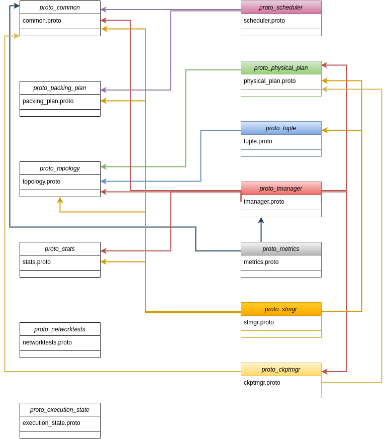

# _**Heron Protocol Buffers Migration to Native Bazel Rules**_

 We need to generate the [Python protobuf](https://thethoughtfulkoala.com/posts/2020/05/08/py-protobuf-bazel.html) and use Bazel's native [rules](https://docs.bazel.build/versions/main/be/overview.html#rules) for [Java and CC](https://github.com/bazelbuild/rules_proto). Java and CC examples are [here](https://blog.bazel.build/2017/02/27/protocol-buffers.html).

Working on assembling the Protobuf in isolation on this repository for [PR #3768](https://github.com/apache/incubator-heron/pull/3768).



<br>

### **_Automated BUILD file generation using Gazelle_**

Protocol Buffer `BUILD` files are located in the [`proto/`](proto/) directory.

To generate/update the `BUILD` files run `bazel run //:gazelle -- proto` from the repository root directory.

<br>

### Directory Tree

```bash
├── BUILD.bazel
├── deps
│   ├── BUILD.bazel
│   ├── core_deps.bzl
│   ├── go_core_deps.bzl
│   ├── grpc_core_deps.bzl
│   ├── grpc_deps.bzl
│   ├── grpc_java_deps.bzl
│   ├── prebuilt_protoc_deps.bzl
│   ├── protobuf_core_deps.bzl
│   └── protobuf_deps.bzl
├── go_deps.bzl
├── go.mod
├── go.sum
├── language
│   ├── example
│   │   ├── BUILD.bazel
│   │   └── example.go
│   └── protobuf
│       ├── BUILD.bazel
│       ├── oldtestdata
│       │   ├── gogo
│       │   │   ├── BUILD.bazel
│       │   │   ├── BUILD.in
│       │   │   ├── BUILD.out
│       │   │   ├── test.proto
│       │   │   └── WORKSPACE
│       │   └── java
│       │       ├── BUILD.bazel
│       │       ├── BUILD.in
│       │       ├── BUILD.out
│       │       ├── test.proto
│       │       └── WORKSPACE
│       └── protobuf.go
├── pkg
│   ├── BUILD.bazel
│   ├── language
│   │   ├── noop
│   │   │   ├── BUILD.bazel
│   │   │   └── noop.go
│   │   └── protobuf
│   │       ├── BUILD.bazel
│   │       ├── config.go
│   │       ├── fix.go
│   │       ├── generate.go
│   │       ├── generate_test.go
│   │       ├── kinds.go
│   │       ├── lang.go
│   │       ├── override.go
│   │       ├── override_test.go
│   │       └── resolve.go
│   ├── plugin
│   │   ├── builtin
│   │   │   ├── BUILD.bazel
│   │   │   ├── cpp_plugin.go
│   │   │   ├── cpp_plugin_test.go
│   │   │   ├── csharp_plugin.go
│   │   │   ├── csharp_plugin_test.go
│   │   │   ├── doc.go
│   │   │   ├── grpc_grpc_cpp.go
│   │   │   ├── java_plugin.go
│   │   │   ├── java_plugin_test.go
│   │   │   ├── js_closure_plugin.go
│   │   │   ├── js_closure_plugin_test.go
│   │   │   ├── js_common_plugin.go
│   │   │   ├── js_common_plugin_test.go
│   │   │   ├── objc_plugin.go
│   │   │   ├── objc_plugin_test.go
│   │   │   ├── php_plugin.go
│   │   │   ├── php_plugin_test.go
│   │   │   ├── python_plugin.go
│   │   │   ├── python_plugin_test.go
│   │   │   ├── ruby_plugin.go
│   │   │   └── ruby_plugin_test.go
│   │   ├── gogo
│   │   │   └── protobuf
│   │   │       ├── BUILD.bazel
│   │   │       └── protoc-gen-gogo.go
│   │   ├── golang
│   │   │   └── protobuf
│   │   │       ├── BUILD.bazel
│   │   │       ├── protoc-gen-go.go
│   │   │       └── protoc-gen-go_test.go
│   │   ├── grpc
│   │   │   ├── grpc
│   │   │   │   ├── BUILD.bazel
│   │   │   │   ├── grpc_test.go
│   │   │   │   ├── protoc-gen-grpc-python.go
│   │   │   │   └── protoc-gen-grpc-python_test.go
│   │   │   ├── grpcgo
│   │   │   │   ├── BUILD.bazel
│   │   │   │   └── protoc-gen-go-grpc.go
│   │   │   ├── grpcjava
│   │   │   │   ├── BUILD.bazel
│   │   │   │   └── protoc-gen-grpc-java.go
│   │   │   └── grpcnode
│   │   │       ├── BUILD.bazel
│   │   │       └── protoc-gen-grpc-node.go
│   │   ├── grpcecosystem
│   │   │   └── grpcgateway
│   │   │       ├── BUILD.bazel
│   │   │       └── protoc-gen-grpc-gateway.go
│   │   ├── scalapb
│   │   │   └── scalapb
│   │   │       ├── BUILD.bazel
│   │   │       ├── protoc_gen_scala.go
│   │   │       └── protoc_gen_scala_test.go
│   │   ├── stackb
│   │   │   └── grpc_js
│   │   │       ├── BUILD.bazel
│   │   │       └── protoc-gen-grpc-js.go
│   │   └── stephenh
│   │       └── ts-proto
│   │           ├── BUILD.bazel
│   │           └── protoc-gen-ts-proto.go
│   ├── protoc
│   │   ├── BUILD.bazel
│   │   ├── depsresolver.go
│   │   ├── depsresolver_test.go
│   │   ├── fake_proto_library_test.go
│   │   ├── file.go
│   │   ├── file_test.go
│   │   ├── intent.go
│   │   ├── intent_test.go
│   │   ├── language_config.go
│   │   ├── language_config_test.go
│   │   ├── language_plugin_config.go
│   │   ├── language_rule_config.go
│   │   ├── language_rule_config_test.go
│   │   ├── language_rule.go
│   │   ├── other_proto_library.go
│   │   ├── other_proto_library_test.go
│   │   ├── package_config.go
│   │   ├── package_config_test.go
│   │   ├── package.go
│   │   ├── package_test.go
│   │   ├── plugin_configuration.go
│   │   ├── plugin_context.go
│   │   ├── plugin.go
│   │   ├── plugin_registry.go
│   │   ├── protoc_configuration.go
│   │   ├── protoc_configuration_test.go
│   │   ├── proto_compiled_sources.go
│   │   ├── proto_compile.go
│   │   ├── proto_descriptor_set.go
│   │   ├── proto_enum_option_collector.go
│   │   ├── proto_library.go
│   │   ├── proto_plugin_config_test.go
│   │   ├── registry.go
│   │   ├── resolver.go
│   │   ├── resolver_test.go
│   │   ├── rewrite.go
│   │   ├── rewrite_test.go
│   │   ├── ruleindex.go
│   │   ├── rule_provider.go
│   │   ├── rule_registry.go
│   │   ├── syntaxutil.go
│   │   └── yconfig.go
│   └── rule
│       ├── rules_cc
│       │   ├── BUILD.bazel
│       │   ├── cc_library.go
│       │   ├── grpc_cc_library.go
│       │   └── proto_cc_library.go
│       ├── rules_closure
│       │   ├── BUILD.bazel
│       │   ├── closure_js_library.go
│       │   ├── grpc_closure_js_library.go
│       │   └── proto_closure_js_library.go
│       ├── rules_go
│       │   ├── BUILD.bazel
│       │   ├── go_library.go
│       │   └── go_library_test.go
│       ├── rules_java
│       │   ├── BUILD.bazel
│       │   ├── grpc_java_library.go
│       │   ├── java_library.go
│       │   └── proto_java_library.go
│       ├── rules_nodejs
│       │   ├── BUILD.bazel
│       │   ├── grpc_nodejs_library.go
│       │   ├── js_library.go
│       │   ├── proto_nodejs_library.go
│       │   └── proto_ts_library.go
│       ├── rules_python
│       │   ├── BUILD.bazel
│       │   ├── grpc_py_library.go
│       │   ├── proto_py_library.go
│       │   └── py_library.go
│       └── rules_scala
│           ├── BUILD.bazel
│           ├── scala_library.go
│           └── scala_proto_library.go
├── proto
│   ├── api
│   │   ├── BUILD.bazel
│   │   └── topology.proto
│   ├── BUILD.bazel
│   ├── ckptmgr
│   │   ├── BUILD.bazel
│   │   └── ckptmgr.proto
│   ├── config.yaml
│   ├── scheduler
│   │   ├── BUILD.bazel
│   │   └── scheduler.proto
│   ├── stmgr
│   │   ├── BUILD.bazel
│   │   └── stmgr.proto
│   ├── system
│   │   ├── BUILD.bazel
│   │   ├── common.proto
│   │   ├── execution_state.proto
│   │   ├── metrics.proto
│   │   ├── packing_plan.proto
│   │   ├── physical_plan.proto
│   │   ├── stats.proto
│   │   └── tuple.proto
│   ├── testing
│   │   ├── BUILD.bazel
│   │   └── networktests.proto
│   └── tmanager
│       ├── BUILD.bazel
│       └── tmanager.proto
├── protobuf_diagram.png
├── README.md
├── rules
│   ├── BUILD.bazel
│   ├── cc
│   │   ├── BUILD.bazel
│   │   ├── grpc_cc_library.bzl
│   │   └── proto_cc_library.bzl
│   ├── depsgen.bzl
│   ├── example.bzl
│   ├── go
│   │   ├── BUILD.bazel
│   │   └── proto_go_library.bzl
│   ├── java
│   │   ├── BUILD.bazel
│   │   ├── grpc_java_library.bzl
│   │   └── proto_java_library.bzl
│   ├── private
│   │   ├── BUILD.bazel
│   │   ├── execution.bzl
│   │   ├── list_repository_tools_srcs.go
│   │   ├── proto_repository_tools.bzl
│   │   └── proto_repository_tools_srcs.bzl
│   ├── proto
│   │   ├── BUILD.bazel
│   │   └── proto_repository.bzl
│   ├── proto_compile.bzl
│   ├── proto_compiled_sources.bzl
│   ├── proto_compiled_source_update.bzl
│   ├── proto_compile_gencopy.bzl
│   ├── proto_dependency.bzl
│   ├── proto_descriptor_set.bzl
│   ├── proto_gazelle.bzl
│   ├── protogenrule.bzl
│   ├── proto_plugin.bzl
│   ├── providers.bzl
│   └── py
│       ├── BUILD.bazel
│       ├── grpc_py_library.bzl
│       └── proto_py_library.bzl
├── toolchain
│   ├── BUILD.bazel
│   └── toolchain.bzl
└── WORKSPACE
